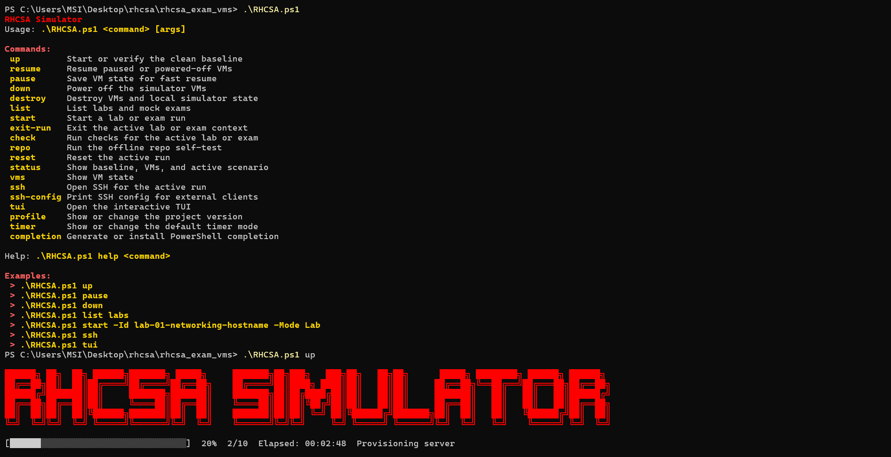
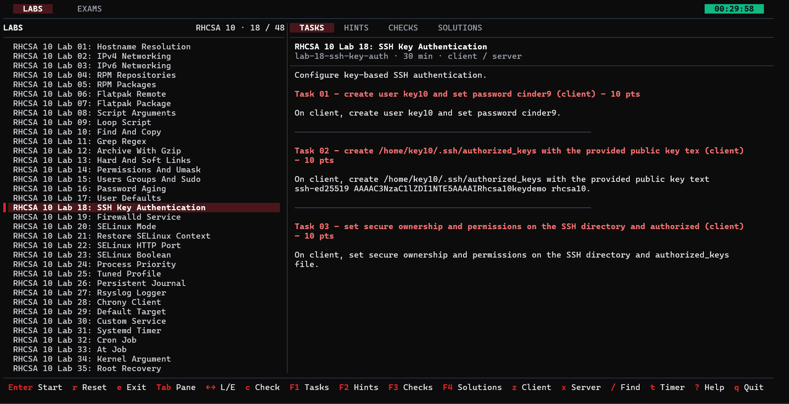

# RHCSA Simulator

<p align="center">
  
</p>

[](https://github.com/firassBenNacib/RHCSA-Simulator/actions)
[](https://github.com/firassBenNacib/RHCSA-Simulator/actions)
[](https://github.com/firassBenNacib/RHCSA-Simulator/releases)
[](./LICENSE)

Interactive RHCSA 9/10 lab and mock exam simulator using PowerShell, Vagrant, VirtualBox, and a Go terminal UI.

## Table of Contents

- [About](#about)
- [Features](#features)
- [Demo](#demo)
- [Requirements](#requirements)
- [Installation](#installation)
- [Quick Start](#quick-start)
- [Recommended Setup](#recommended-setup)
- [RHCSA Profiles](#rhcsa-profiles)
- [Commands](#commands)
- [Common Examples](#common-examples)
- [Terminal UI](#terminal-ui)
- [Project Structure](#project-structure)
- [Scenario Content](#scenario-content)
- [Development](#development)
- [Documentation](#documentation)
- [Contributing](#contributing)
- [License](#license)
- [Author](#author)

## About

RHCSA Simulator helps you practice Red Hat Certified System Administrator tasks in realistic local labs. It creates a client/server VM environment, provides RHCSA 9 and RHCSA 10 practice tracks, and includes automated checks, solutions, SSH helpers, mock exams, and an interactive terminal UI.

The project is designed for hands-on Linux administration practice, not passive reading.

Scenarios are original practice content aligned with public RHCSA objectives. Included solutions are valid ways to reach the checked final state; they are not official Red Hat answers or copied exam material.

## Features

- RHCSA 9 and RHCSA 10 practice tracks
- Local client/server VM lab environment
- Labs and mock exams
- Automated task checking
- Solutions and hints
- Offline repository support
- SSH helpers
- PowerShell CLI
- Go-based terminal UI
- Scenario validation tools
- PowerShell completion support
- Optional lab and exam timer
- CI, security checks, and release automation

## Demo


## Requirements

- Windows 10 or 11
- PowerShell 5.1 or newer
- [Vagrant](https://developer.hashicorp.com/vagrant/install)
- [VirtualBox](https://www.virtualbox.org/wiki/Downloads)
- Hardware virtualization enabled in BIOS/UEFI
- At least 20 GB of free disk space
- RHEL x86_64 DVD ISO for the track you use:
  - RHCSA 9 accepts `rhel-9.*-x86_64-dvd.iso`, such as `rhel-9.8-x86_64-dvd.iso`
  - RHCSA 10 accepts `rhel-10.*-x86_64-dvd.iso`, such as `rhel-10.2-x86_64-dvd.iso`
- Go 1.25+ only if you want to build the TUI from source

RHEL ISO downloads require a Red Hat account. Use the official [Red Hat Developer downloads by release](https://developers.redhat.com/products/rhel/download#downloadsbyrelease) page and choose the x86_64 DVD ISO, not the boot ISO.

Download only the ISO for the track you plan to run. If multiple same-major DVD ISOs are present, the simulator uses the newest matching file. Set `RHCSA_ISO` to a filename or full path when you want to keep the ISO outside the project folder or force a specific ISO.

Recommended: import the offline package repositories once from an ISO path:

```powershell
.\RHCSA.ps1 repo import .\rhel-10.2-x86_64-dvd.iso
```

This creates `.rhcsa-repo/` with the selected track's `BaseOS` and `AppStream` content, so future baseline builds can use the cache when no matching ISO is present in the project root. The ISO can be in the project folder or outside it.

## Installation

Clone the repository:

```powershell
git clone https://github.com/firassBenNacib/RHCSA-Simulator.git
cd RHCSA-Simulator
```

Download the prebuilt TUI binary:

```powershell
irm https://raw.githubusercontent.com/firassBenNacib/RHCSA-Simulator/main/install.ps1 -OutFile install.ps1
powershell -ExecutionPolicy Bypass -File .\install.ps1
```

Provide the RHEL ISO for the selected track. You can either place it in the project root, set `RHCSA_ISO` to an external path, or import the repo cache once.

Example:

```text
RHCSA-Simulator/
|-- RHCSA.ps1
|-- rhel-10.2-x86_64-dvd.iso
`-- ...
```

For an ISO outside the project folder:

```powershell
$env:RHCSA_ISO = "D:\ISO\rhel-10.2-x86_64-dvd.iso"
.\RHCSA.ps1 up
```

## Quick Start



Build the default RHCSA 10 baseline:

```powershell
.\RHCSA.ps1 up
```

List available labs and exams:

```powershell
.\RHCSA.ps1 list
```

Start a lab:

```powershell
.\RHCSA.ps1 start -Id lab-01-hostname-resolution -Mode Lab
```

Open SSH to the client VM:

```powershell
.\RHCSA.ps1 ssh
```

Check your work:

```powershell
.\RHCSA.ps1 check
```

Open the interactive TUI:

```powershell
.\RHCSA.ps1 tui
```

Pause or stop the lab:

```powershell
.\RHCSA.ps1 pause
.\RHCSA.ps1 down
```

Destroy the lab environment:

```powershell
.\RHCSA.ps1 destroy
```

## Recommended Setup

Install PowerShell completion after installation:

```powershell
.\RHCSA.ps1 completion install
```

This enables tab completion for supported commands and options.

Enable the timer if you want exam-like practice during labs and mock exams:

```powershell
.\RHCSA.ps1 timer on
```

Check the timer setting:

```powershell
.\RHCSA.ps1 timer status
```

Disable the timer:

```powershell
.\RHCSA.ps1 timer off
```

The timer is optional. It is useful when you want to train under time pressure.

## RHCSA Profiles

RHCSA 10 is the default profile for new checkouts. RHCSA 9 remains available for RHEL 9 practice.

Show the current profile:

```powershell
.\RHCSA.ps1 profile
```

Use RHCSA 10:

```powershell
.\RHCSA.ps1 profile RHCSA10
.\RHCSA.ps1 up
```

Switch to RHCSA 9:

```powershell
.\RHCSA.ps1 profile RHCSA9
.\RHCSA.ps1 up
```

The active profile controls:

- the selected lab baseline
- the scenario catalog
- the TUI track
- the labs and mock exams shown by default

## Commands

| Command | Description |
|---|---|
| `up` | Start or verify the clean baseline |
| `list` | List labs and mock exams |
| `start` | Start a lab or exam |
| `check` | Run checks for the active run |
| `ssh` | Open SSH to the active VM |
| `tui` | Open the terminal UI |
| `pause` | Save VM state |
| `resume` | Resume saved VMs |
| `down` | Power off VMs |
| `reset` | Reset the active lab or exam |
| `exit-run` | Exit the active scenario context |
| `status` | Show current simulator status |
| `vms` | Show VM state |
| `repo` | Test the offline repository |
| `profile` | Show or change RHCSA profile |
| `timer` | Enable, disable, or show the lab/exam timer |
| `completion` | Generate or install PowerShell tab completion |
| `ssh-config` | Print SSH configuration |
| `destroy` | Remove VMs and local lab state |
| `help` | Show help |

Show full help:

```powershell
.\RHCSA.ps1 help
```

## Common Examples

Start a specific lab:

```powershell
.\RHCSA.ps1 start -Id lab-01-hostname-resolution -Mode Lab
```

Start a mock exam:

```powershell
.\RHCSA.ps1 start -Id rhcsa10-mock-exam-a -Mode Exam
```

Run checks:

```powershell
.\RHCSA.ps1 check
```

Reset the active run:

```powershell
.\RHCSA.ps1 reset
```

Refresh the clean baseline:

```powershell
.\RHCSA.ps1 up -Refresh
```

Start without provisioning:

```powershell
.\RHCSA.ps1 up -NoProvision
```

Install PowerShell completion:

```powershell
.\RHCSA.ps1 completion install
```

Enable the lab and exam timer:

```powershell
.\RHCSA.ps1 timer on
```

Check timer status:

```powershell
.\RHCSA.ps1 timer status
```

Disable the timer:

```powershell
.\RHCSA.ps1 timer off
```

Force host cleanup if Vagrant or VirtualBox locks are stuck:

```powershell
.\RHCSA.ps1 up -ForceHostCleanup
```

## Terminal UI



Open the TUI through the PowerShell entrypoint:

```powershell
.\RHCSA.ps1 tui
```

Or run the launcher:

```powershell
.\rhcsa-tui.cmd
```

Useful shortcuts:

| Key | Action |
|---|---|
| `Enter` | Start selected lab or exam |
| `Tab` | Switch panes |
| `←` / `→` | Switch tabs or documents |
| `F1` | Tasks |
| `F2` | Hints |
| `F3` | Checks |
| `F4` | Solutions |
| `c` | Run checks |
| `r` | Reset active run |
| `e` | Exit active run |
| `/` | Search |
| `t` | Toggle timer |
| `z` | SSH to client |
| `x` | SSH to server |
| `?` | Help |
| `q` | Quit |

## Project Structure

```text
RHCSA-Simulator/
|-- RHCSA.ps1              # Main PowerShell CLI
|-- host/                  # Host orchestration and checks
|-- guest/                 # VM provisioning scripts
|-- cmd/rhcsa-tui/         # Go terminal UI
|-- internal/              # Shared Go packages
|-- scenarios/
|   |-- labs/              # RHCSA labs
|   `-- exams/             # RHCSA mock exams
|-- tools/scenarios/       # Scenario tooling
|-- docs/                  # Project documentation
|-- demo/                  # Demo assets
`-- .github/               # CI, security, and release workflows
```

## Scenario Content

Scenario files are stored by mode and track:

```text
scenarios/labs/rhcsa9/
scenarios/labs/rhcsa10/
scenarios/exams/rhcsa9/
scenarios/exams/rhcsa10/
```

Each track is kept separate so RHCSA 9 and RHCSA 10 objectives do not mix.

## Development

Install the required development tools:

- Go
- Python
- PowerShell
- Vagrant
- VirtualBox

Run local checks:

```bash
make test
```

Windows equivalents:

```powershell
go test ./...
go vet ./...
go build ./cmd/rhcsa-tui
<python> -m pytest tools/scenarios/tests -q
<python> .\host\verify_scenario_solutions.py --kind all --track all --audit-only
<python> .\tools\scenarios\audit_scenarios.py
```

Replace `<python>` with the Python launcher available on your machine, such as `python`, `python3.13.exe`, or `py -3.13`.

Build the TUI from source:

```powershell
go build -o rhcsa-tui.exe ./cmd/rhcsa-tui
.\rhcsa-tui.exe
```

## Documentation

Additional documentation:

- [Project organization](docs/project-organization.md)
- [Scenario coverage](docs/scenario-coverage.md)
- [RHCSA 9 track notes](docs/rhcsa9-track.md)
- [RHCSA 10 track notes](docs/rhcsa10-track.md)
- [Release process](docs/release.md)
- [Contributing guide](CONTRIBUTING.md)

## Contributing

Contributions are welcome.

Before opening a pull request:

```bash
make test
```

For scenario changes, also run:

```powershell
<python> .\host\verify_scenario_solutions.py --kind all --track all --audit-only
<python> .\tools\scenarios\audit_scenarios.py
```

`--audit-only` checks replay metadata without starting VMs. For one changed scenario, use `--track` and `--only` to limit validation:

```powershell
<python> .\host\verify_scenario_solutions.py --kind lab --track RHCSA10 --only lab-06-flatpak-remote --audit-only
<python> .\host\verify_scenario_solutions.py --kind lab --track RHCSA10 --only lab-06-flatpak-remote
```

Run live replay when scenario setup, checks, provisioning, or solution commands change.

See [CONTRIBUTING.md](CONTRIBUTING.md) for coding rules, scenario rules, and the expected workflow.

## License

This project is licensed under the [MIT License](./LICENSE).

## Author

Created and maintained by Firas Ben Nacib - [bennacibfiras@gmail.com](mailto:bennacibfiras@gmail.com)
